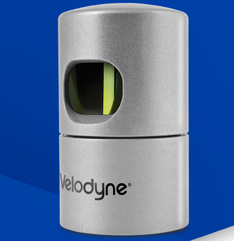

>本篇博客回顾硕士期间做过的一些工作：激光雷达SLAM。

## 前言

这是我在研一接触的一项工作，基于激光雷达的车辆定位。这个项目是师兄基于一项比赛来做的，主要目的是实现无人车辆在越野环境下的无GPS定位。

算法的整体框架：

## 硬件

- 比亚迪 唐

- velodyne 32线激光雷达

- 捷联光纤惯导

## 软件

### 步骤一

**建立激光雷达点云地图：**

算法主要分为三步，数据预处理、特征概率地图更新、点云与地图匹配并更新位姿。数据预处理是对激光雷达点云进行初步处理，降采样及分类等；特征概率地图更新部分主要作用是进行地图的管理以及点云分布特征的提取、栅格的更新等；点云匹配及位姿更新是通过每帧点云与特征地图之间进行数据关联，然后利用匹配算法，估计当前位姿。为提高算法实时性，使用两个线程分别进行特征地图更新和位姿估计。

这一步生成了一系列的子地图，经过拼接，全局点云地图为

### 步骤二

**匹配定位：**

首先利用激光雷达和惯导等数据，并行运行与惯导姿态融合的激光雷达里程计算法以及离线特征地图匹配定位算法。然后在第三个进程中综合上述两种信息，进行匹配状态判断，该部分通过判断车辆运动时雷达里程计的位姿变换与离线地图匹配定位的位姿变换的差别，从而验证离线地图匹配定位成功与否，差别超过设定阈值或离线地图匹配定位模块无输出则认为匹配定位失效。如果匹配成功则输出匹配定位的位姿作为全局定位结果，匹配失败或者未在离线地图覆盖区域则使用激光雷达里程计来推测全局定位坐标，并用该结果作为初始定位源来重置离线地图匹配模块，使其重新进行地图初匹配和位姿跟踪。

位姿匹配的结果为：

